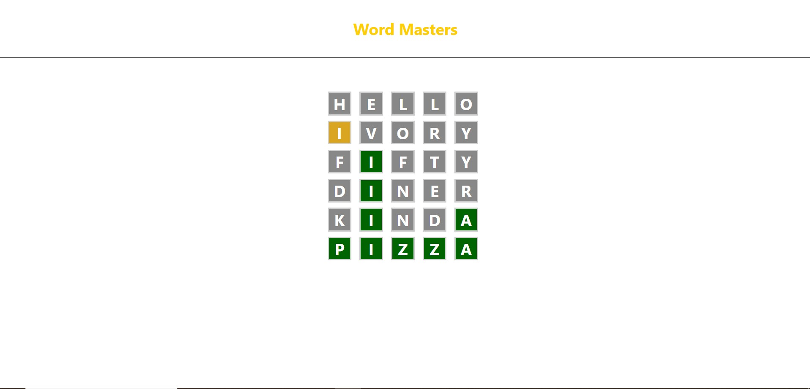

# Wordle Game

A fun and interactive implementation of the popular Wordle game. The game challenges users to guess a five-letter word within six attempts, providing visual feedback for correct and incorrect guesses.

> 🔴 Live demo: ((https://project-wordle-game.netlify.app/)

## 📸 Screenshots

### 💻 View



## Features

- Guess a five-letter word with up to 6 attempts.
- Receive color-coded feedback:
  - **Green**: Correct letter in the correct position.
  - **Yellow**: Correct letter in the wrong position.
  - **Gray**: Incorrect letter.
- Automatically resets after a successful guess or after 6 failed attempts.
- The word of the day is dynamically fetched from an external API.

## Technologies Used

- **HTML**: For structuring the game layout.
- **CSS**: For styling the interface.
- **JavaScript**: For implementing the game logic and fetching the word of the day.

## Installation

1. Clone the repository:
   ```bash
   git clone https://github.com/rotariu-alexandra/Wordle-Game.git
